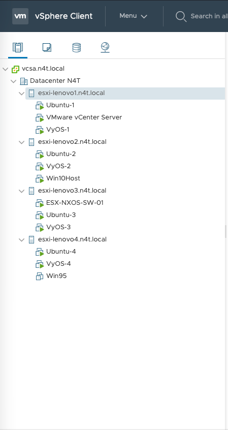

# Virtualization Lab

Hands-on virtualization lab covering VMware ESXi, Proxmox VE, virtual networking, VLANs, storage, VM deployment, and infrastructure troubleshooting.

The lab is used to explore how traditional network infrastructure integrates with hypervisors, virtual switches, Linux bridges, and virtual machines.

## Technologies

- VMware ESXi
- Proxmox VE
- Linux
- Virtual switches
- Linux bridges
- 802.1Q VLAN tagging
- Trunk and access ports
- Virtual NICs
- Shared and local storage
- Network troubleshooting

## VMware ESXi

The VMware portion of the lab focuses heavily on virtual networking.

Topics include:

- ESXi host networking
- Standard virtual switches
- VMkernel interfaces
- Management networks
- Port groups
- VLAN tagging
- Physical switch trunks
- Native VLANs
- Tagged VLANs
- VM network connectivity
- Physical-to-virtual network troubleshooting

### VLAN Tagging

An important part of the lab is understanding where an 802.1Q VLAN tag is added or removed.

For example:

```text
Physical Switch                    ESXi Port Group
---------------------------------------------------------
VLAN 10 native / untagged   --->   VLAN ID 0
VLAN 10 tagged              --->   VLAN ID 10
```

A mismatch between physical switch trunk configuration and ESXi port-group configuration can result in loss of management or VM connectivity.

A detailed sanitized case study is included under:

```text
vmware/esxi-vlan-troubleshooting.md
```

## Proxmox VE

The Proxmox portion of the lab focuses on Linux-based virtualization and networking.

Topics include:

- Proxmox VE installation
- VM deployment
- Linux bridges
- Physical NIC integration
- VLAN-aware bridges
- Tagged VLANs
- VM network configuration
- Storage
- Linux troubleshooting

Example network architecture:

```text
Physical Switch
      |
      | 802.1Q Trunk
      |
      v
 Physical NIC
      |
      v
    vmbr0
  VLAN-aware
      |
      +-------- VM - VLAN 10
      |
      +-------- VM - VLAN 20
      |
      +-------- VM - VLAN 30
```

This provides a useful comparison between VMware virtual switching and Linux bridge-based virtualization.

## Network Engineering Perspective

The primary focus of this lab is the interaction between virtualization and the network.

The same networking concepts exist across physical and virtual environments:

```text
Physical Network             Virtualization
------------------------------------------------
Switch Port                  Physical NIC
802.1Q Trunk                 Hypervisor Uplink
VLAN                         Port Group / VLAN Tag
Switch                       vSwitch / Linux Bridge
Access Port                  VM Network Assignment
Layer-2 Domain               Virtual Network
```

Understanding both sides is important when troubleshooting connectivity between physical switches, hypervisors, and virtual machines.

## Troubleshooting

Lab troubleshooting includes:

- Incorrect VLAN tagging
- Native VLAN mismatches
- VM connectivity failures
- Hypervisor management connectivity
- Physical switch trunk configuration
- Port-group configuration
- Linux bridge configuration
- VM NIC configuration

The goal is to validate the entire traffic path:

```text
Physical Switch
      |
      v
Physical NIC
      |
      v
Virtual Switch / Linux Bridge
      |
      v
Port Group / VLAN
      |
      v
Virtual NIC
      |
      v
Virtual Machine
```

## Repository Structure

```text
virtualization-lab/
├── README.md
├── vmware/
│   └── esxi-vlan-troubleshooting.md
├── proxmox/
│   └── networking.md
└── diagrams/
```

## Future Lab Work

Planned additions include:

- Additional ESXi networking scenarios
- Proxmox VLAN-aware bridge configuration
- VM migration testing
- Storage configuration
- Virtual firewall deployment
- Kubernetes VM hosting
- Network automation integration
- Infrastructure monitoring

## Security and Sanitization

This repository contains lab-built and sanitized examples only.

Hostnames, IP addresses, credentials, certificates, serial numbers, and other potentially sensitive information are removed or sanitized.

No employer, customer, or production configuration data is included.


### VMware vSphere Lab

The VMware lab consists of multiple ESXi hosts managed through VMware vCenter Server.



The environment is used to test:

- Multi-host ESXi networking
- Virtual switching and port groups
- 802.1Q VLAN trunking
- VM migration between hosts
- Linux and Windows virtual machines
- Virtual network appliances
- Network connectivity troubleshooting

The lab provides a platform for testing the interaction between physical switching, ESXi virtual networking, and virtual machines.
